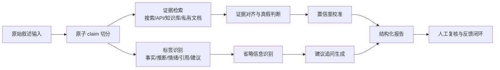
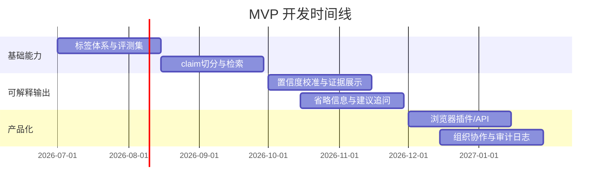

# 叙述置信度分析器市场调研报告

## 执行摘要

结论：市场上**已经有相邻产品与工具**，但还没有形成一个公认、标准化、占据心智的“叙述置信度/表述可信度分析器”独立品类。现有方案分散在**事实核查、来源可信度评级、叙事风险监测、AI 幻觉审计**四条线上，说明需求真实存在，但产品定义仍未收敛，这恰恰留下了做统一层产品的窗口。citeturn30view1turn31view1turn32view0turn33view1turn15view1turn12view0turn35search1

检索日期：**2026-06-21（欧洲/伦敦时区）**。以下未注明者，均为截至该日期公开可得信息；若官网未披露，我以“未公开/未找到”标注。citeturn30view0turn33view1turn32view0

| 要点 | 结论 |
|---|---|
| 是否已有同类 | **有“相邻同类”，少有“完整同类”** |
| 最接近的现成产品 | FactSentinel、InformLens、Veritier 更接近“对具体表述做置信度审阅”；NewsGuard、Google、Full Fact、Logically、Blackbird 更接近上游或旁路能力 |
| 市场机会 | 把“**事实/推断/情绪/省略信息/建议追问**”放进同一份可解释报告，并给出**校准后的置信度**与**证据链** |
| 推荐切入 | 先做 **B2B Copilot**，从新闻媒体、法务/风险、客服质检、保险理赔四类高价值场景切入 |
| 产品定位 | 不要宣称“判定真相”，而应定位为“**证据链接的不确定性分析器**” |

## 产品定义与建议功能清单

从学术定义看，自动事实核查通常分成三步：**声明检测、证据检索、结论与理由生成**。Google 的 ClaimReview 结构化标准则把“被审核声明、声明者、评分、解释”等字段标准化；而更接近你设想的产品，如 InformLens 和 FactSentinel，已经开始把**归因、佐证、上下文、 caveat、model disagreement**做成结构化输出。也就是说，市场并不缺单点能力，缺的是把“叙述”拆成可判读的多层标签并给出可操作建议的统一产品。citeturn8search7turn31view2turn12view0turn15view1

我建议把“叙述置信度/表述可信度分析器”定义为：**对一句话、一个段落或一段长叙述，自动拆分为可检验声明，并输出其证据支持度、表达属性、潜在省略、需要追问的点，以及机器自身对该判断的置信度**。这一定位比传统 fact-check 更宽，比纯情绪分析更深，也比来源评级更细。citeturn6search0turn36search0turn37search0turn15view1turn12view0

建议的输入/输出格式如下。这里是**产品设计建议**，不是现有行业唯一标准；其底层字段参考了 FEVER 的 verdict、ClaimReview 的 claim/rating/explanation，以及相邻产品的 evidence/caveat/model agreement 设计。citeturn6search0turn31view1turn15view1turn12view0turn35search1

```json
{
  "input": {
    "text": "在希腊有奇妙历险，遇到了一个路怒症疯子追了我们二十分钟……",
    "language": "zh-CN",
    "context": "社交媒体发帖/聊天记录/客服投诉/新闻稿",
    "attachments": ["url or image or video optional"]
  },
  "output": {
    "overall_confidence": 0.71,
    "segments": [
      {
        "claim_text": "有人持续追车二十分钟并扔东西",
        "type": "事实",
        "verdict": "证据不足/待核实/大概率真实/矛盾",
        "confidence": 0.76,
        "evidence": [],
        "missing_context": ["事件时间", "地点", "报警记录", "车损照片"],
        "follow_up_questions": ["是否有报警或保险记录？"]
      },
      {
        "claim_text": "对方是路怒症疯子",
        "type": "推断/情绪化定性",
        "confidence": 0.39
      }
    ]
  }
}
```

建议的标签体系可分为五类：**事实**、**推断**、**情绪/立场表达**、**省略信息**、**建议追问**。其中“省略信息”和“建议追问”是差异化重点，因为 AmbiFC 说明，真实世界中的争议并不总来自真假本身，而常来自**表述欠指明、概率性表达、证据上下文不足**；JustiLM 和 AVeriTeC 也表明，只有把“理由/解释”显式化，系统才更接近可用。citeturn37search0turn36search1turn36search0

置信度分级建议不要只给单一分数，而要给**解释性等级**：

| 分级 | 分数建议 | 含义 |
|---|---:|---|
| 高 | 0.80–1.00 | 有明确证据链，结论稳定 |
| 中 | 0.55–0.79 | 有部分证据，但上下文或时效性仍不足 |
| 低 | 0.30–0.54 | 证据稀薄、表述含混或模型分歧明显 |
| 拒答 | 0–0.29 | 不宜自动下结论，应触发人工复核 |

这种“显式拒答/升级人工”的设计很重要，因为现代模型的原始置信度往往**不校准**；温度缩放、FaR、conformal factuality 等方法表明，产品若直接暴露模型概率，容易过度自信。citeturn6search2turn24search0turn24search1turn24search10

## 学术研究与关键论文综述

过去十年，这一方向的核心研究脉络已经很清晰：先做**check-worthy claim spotting**，再做**evidence retrieval**，然后做**veracity prediction + justification**；近两年又明显向**真实世界网页证据、解释性、歧义处理、长文本与 LLM 置信度校准**发展。citeturn8search1turn8search2turn36search0turn37search0turn24search0

| 论文 | 年份 | 原始来源 | 中文要点 |
|---|---:|---|---|
| ClaimBuster: The First-ever End-to-end Fact-checking System | 2017 | VLDB/PVLDB citeturn5search3 | 早期端到端事实核查系统，证明“声明抽取→核验→输出”可工程化 |
| FEVER: a Large-scale Dataset for Fact Extraction and VERification | 2018 | ACL/NAACL citeturn6search0turn6search12 | 奠定三分类范式：Supported / Refuted / Not Enough Info，并要求证据句 |
| DeClarE: Debunking Fake News and False Claims using Evidence-Aware Deep Learning | 2018 | ACL/EMNLP citeturn6search1 | 强调“外部证据 + 来源可信度 + 可解释注意力”，非常接近商业产品逻辑 |
| ClaimRank: Detecting Check-Worthy Claims in Arabic and English | 2018 | 原论文/系统论文 citeturn5academia10 | 说明“哪些句子值得核查”本身就是可独立产品化的任务 |
| A Survey on Automated Fact-Checking | 2022 | TACL citeturn8search1turn8search7 | 最权威综述之一，把任务统一为声明检测、证据检索、结论与理由生成 |
| Multimodal Automated Fact-Checking: A Survey | 2023 | EMNLP Findings citeturn8search2turn8search5 | 说明产品若要进媒体/平台，必须支持图像、音频、视频的“断章取义”与真假混合问题 |
| AVeriTeC: A Dataset for Real-world Claim Verification with Evidence from the Web | 2023 | NeurIPS Datasets / arXiv citeturn36search0turn36search2 | 关键突破：证据来自开放网络而非固定 Wikipedia，更接近真实生产环境 |
| JustiLM: Few-shot Justification Generation for Explainable Fact-Checking | 2024 | TACL citeturn36search1 | 把“理由生成”从附属功能提升为核心能力，适合做可审计产品输出 |
| AmbiFC: Fact-Checking Ambiguous Claims with Evidence | 2024 | TACL citeturn37search0turn37search2 | 非常重要：很多场景不是“真假”，而是“表述歧义”“信息未说全”“概率性推断” |
| The Automated Verification of Textual Claims Shared Task | 2024 | FEVER Workshop citeturn8search0 | 表明行业最新 benchmark 已从“分类准确率”转向“证据质量 + 结论正确”的综合评分 |

如果只选对产品最有指导意义的三条学术结论，我会提炼为：第一，**别只做真假二分类**，真实世界更常见的是“证据不足、上下文缺失、说法模糊”；第二，**解释与证据链不是附件，而是主功能**；第三，**真实价值在开放网络与多模态环境中，而不在封闭基准上刷高分**。citeturn37search0turn36search1turn36search0turn8search0

## 现有商业产品与服务调研

综合官网与官方文档看，市场上已经有不少工具覆盖“表述可信度”的部分能力，但大多只覆盖其中一块：**来源可信度**、**既有事实核查检索**、**叙事风险监测**、**具体 claim 审阅**、**AI 产出事实核验**。这说明你要做的不是“从零发明需求”，而是把分散能力重新打包。citeturn30view1turn31view1turn32view0turn33view1turn15view1turn12view0turn35search1

| 公司/产品 | 官网与依据 | 主要能力 | 目标用户 | API/SDK | 是否开源 | 定价/商业模式 | 发布日期/最新更新 | 评估 |
|---|---|---|---|---|---|---|---|---|
| NewsGuard | 官网/产品页 citeturn30view1turn30view2turn30view0turn16search1 | 来源可靠性评级、False Claim Fingerprints、AI guardrail 数据流；35,000+来源、API/datastream | AI 公司、平台、广告、研究机构、消费者 | **有 API / datastream** citeturn30view1turn30view2 | 否 | 个人版 **$4.95/月**；企业需洽谈 citeturn30view0 | 浏览器产品公开报道 2019；NewsGuard for AI 于 2023-02-15 发布 citeturn10search7turn16search1 | 更像“来源可信度基础设施”，不是对单句叙述做细粒度分析 |
| Google Fact Check Explorer / API | 官方博客与开发者文档 citeturn31view0turn31view1turn31view2 | 搜索既有事实核查；文本/图片检索；ClaimReview 读写 | 记者、事实核查机构、开发者 | **有 API**，需 API key citeturn31view1 | 否 | 价格未公开；受 Google API 条款约束 citeturn25search0turn25search8 | 图像搜索全球 beta 于 2023 年公开；开发文档最后更新 2023-05-25；Google Search 对 ClaimReview 正逐步退场，但 Explorer 仍支持 citeturn31view0turn31view1turn31view2 | 更像“已发布核查结果检索器”，不能直接分析新叙述的省略与情绪成分 |
| Full Fact AI | 官方 AI 页面/年报 citeturn29search0turn29search1turn29search11 | 媒体监测、发现误导信息、辅助事实核查；全球 45+ 机构、30 国使用 | 事实核查组织、媒体、公益机构 | **未见公开 API** | 否 | 以组织合作/服务为主，公开定价未找到 citeturn29search5 | 自 2016 年开展自动化事实核查；2026 年官网仍持续更新 citeturn16search2turn29search3 | 强在工作流与组织网络，不强在面向普通文本的通用分析器产品化 |
| Logically Intelligence / PRISMα | 官网/AI Info/发布稿 citeturn33view1turn33view2turn33view3turn33view0 | 叙事监测、聚类、告警、地理与网络视图、模拟与行动建议 | 政府、公共安全、企业风险团队 | **未见公开面向开发者的标准 API 文档** | 否 | Demo/项目制，价格未公开 | 公司成立 2017；Logically Intelligence 平台于 2021 年公开发布；2026 年官网描述为 fast-deploy SaaS + scoped PoC citeturn33view1turn33view0 | 很接近“叙事层 intelligence”，但偏机构级风控，不是句子级置信度分析器 |
| Blackbird.AI Constellation / Compass Context | 官网/AI Info/API 文档 citeturn32view0turn32view2turn12view3turn12view4 | Narrative intelligence、风险评分、跨 25+ 语言、深伪检测；Compass Context 可对 claim/URL 生成带引用的上下文分析 | 企业、公部门、平台、情报/安全团队 | **有 API**（Constellation API、Compass Context API） citeturn32view0turn32view2 | 否 | 企业授权，价格需联系销售 citeturn12view3 | 公司 2017；Constellation 新一代平台 2023-01-09 发布；2026 年 API 仍公开可接入 citeturn32view0turn32view1turn32view2 | 是较强竞品，但更偏“叙事攻击/风险情报”，并非面向个人文本的解释型评审器 |
| FactSentinel | 官网/产品页/定价页 citeturn15view2turn15view1turn15view0 | 对**具体 claim**给出 verdict、confidence、reasoning、caveats、model agreement、sources；支持浏览器与 Web Checker | 编辑、记者、研究者、教育者、普通用户 | **未见公开 API** | 否 | 免费；Platform **$5/月**；BYOK **$29 一次性** citeturn15view0turn15view2 | 首发日期未公开；2026 年官网在售 | **最接近你的想法之一**，但仍偏“核验单条 claim”，对“省略信息/追问建议”的体系还不够深 |
| InformLens | 官网页 citeturn12view0 | 分析 attribution、corroboration、context、source strength，显式给出 “what is true / not proven / evidence risks / source audit” | 记者、研究者、制作人、调查人员 | 未找到公开 API/SDK | 否 | 定价未公开 | 上线日期未公开；2026 年官网可访问 | **非常接近“表述可信度分析”**，尤其强调“事实 vs 假设、缺失上下文” |
| Veritier | 官网/skill 文档 citeturn35search1turn35search0 | 从文本或文档中抽取可证伪 claim，并实时连接网页或私有参考进行核验；输出 Claim / Verdict / Confidence / Explanation / Sources | 开发者、AI 应用、内容审校团队 | **有 API / MCP** citeturn35search1 | 否 | Free；Pro **$19.99/月**；Business **$249.99/月** citeturn35search1turn35search0 | 2026 年公开可用；具体首发日未公开 | 与你的方向最匹配的 API 化产品之一，但重心仍是“claim verification”，不是“完整叙述分析” |

我的判断是：**直接竞品很少，替代竞品很多**。如果把赛道定义成“给整段叙述做表述可信度分析，并解释哪里是事实、哪里是推断、哪里省略了关键信息”，那么现有最接近者是 **FactSentinel、InformLens、Veritier**；如果定义成“帮助机构识别叙事风险与不实信息”，那 **Blackbird.AI、Logically、NewsGuard、Full Fact、Google** 已经构成成熟替代。citeturn15view1turn12view0turn35search1turn32view0turn33view1turn30view1turn29search1turn31view1

## 相关专利与开源项目

相关专利并不少，说明“自动事实核查、真假评分、复杂 claim 分解、误导信息检测”都已进入可保护的工程实现阶段；但它们多数保护的是**局部方法链路**，还没有哪件公开专利天然覆盖你所说的“叙述层置信度 + 省略信息 + 建议追问”的完整体验。citeturn18search1turn18search4turn18search13

| 类型 | 项目 | 依据 | 简评 |
|---|---|---|---|
| 专利 | **WO2019043379A1 Fact checking** | citeturn18search4 | 与 Full Fact 路线高度相关，强调人工与自动结合，说明 newsroom workflow 可专利化 |
| 专利 | **WO2021058266A1 Deep neural architectures for detecting false claims** | citeturn18search13 | 明确提到可对 claim 输出“可靠/可信的 confidence value”，与“表述置信度评分”最接近 |
| 专利 | **US20250148203A1 System and method for fact-checking complex claims** | citeturn18search1 | 适合处理“复合 claim/多事实组合语句”，对长叙述拆解有参考价值 |
| 专利 | **WO2020005571A1 Misinformation detection in online content** | citeturn18search2 | 偏平台级 misinformation detection，可参考但与产品体验层距离较远 |
| 开源 | **FEVER repo** | citeturn19search1 | 数据集与 baseline 成熟，适合最初版训练与评测 |
| 开源 | **AVeriTeC repo** | citeturn19search2turn36search4 | 更接近真实网页证据，适合做 production-like evaluation |
| 开源 | **ClaimBuster claim spotter** | citeturn5search0 | 非常适合做 claim spotting 第一层，但不是完整产品 |
| 开源 | **Meedan Check** | citeturn20search0turn20search2 | 偏协作式核查工作台，适合 newsroom/OSINT 工作流整合 |
| 开源 | **Automated-Fact-Checking-Resources** | citeturn19search3 | 资源仓库价值高，便于快速补齐论文、数据集、模型地图 |

如果你做产品，知识产权上更适合避开“某个单一分类器”的主张，转而强化三个点：**多标签 schema**、**解释链呈现方式**、**人机协作与升级路径**。这些更不容易被通用 fact-checking 专利覆盖，也更形成产品壁垒。上述判断是基于现有专利公开摘要做的工程推断。citeturn18search1turn18search4turn18search13

## 实现技术栈与可行性评估

技术上，这个产品**完全可做**，而且不需要先解决“通用真理判断”这种不现实问题。更可行的路线是：把输入叙述先拆成原子 claim，再为每个 claim 做**类型识别、证据检索、证据-claim 对齐、结论生成、置信度校准、升级建议**；最后在叙述层汇总“哪里是事实，哪里是推断，哪里会误导”。这一思路与自动事实核查研究主流、AVeriTeC 的真实网页证据路线，以及近期面向解释与校准的工作是一致的。citeturn8search7turn36search0turn36search1turn24search0turn24search1



建议技术栈可以分为四层。第一层是 **NLP 解析层**：句子切分、事件/实体/时间/地点抽取、引用与归因识别、情绪与立场识别。第二层是 **证据层**：开放网页搜索、可信来源白名单、行业知识库、企业私有文档。第三层是 **推理层**：NLI/stance detection、retrieval-augmented generation、证据充足性与时间一致性判断。第四层是 **校准层**：temperature scaling、分桶校准、prompt-level calibration、conformal factuality，必要时支持拒答。citeturn8search1turn8search2turn31view1turn24search0turn24search1turn24search10

多模态支持值得尽早设计接口。原因不是“炫技”，而是现实世界中的误导本来就常表现为**配图断章取义、旧图新编、假音频、截图脱上下文**。Google Fact Check Explorer 已把图像检索纳入产品；Blackbird.AI 明确提供深伪与 AI 生成图像检测；多模态 AFC 综述也指出图文、音频、视频是事实核查的增长重点。citeturn31view0turn32view0turn8search2

最大的误判风险有四类。其一是**歧义**：一句话说得不够具体，系统很容易把“说得不全”误判成“说错”。其二是**时效性**：一个陈述可能昨天错、今天对。其三是**来源污染**：检索到的是低质量转载或 AI 生成站点。其四是**高风险领域过度自信**：医疗、法律、金融、公共安全文本不能只给“看起来像对”的回答。AmbiFC、AVeriTeC、NewsGuard for AI 与多项 LLM factuality 研究都指向同一结论：系统必须显示证据边界、保留不确定性、允许拒答。citeturn37search0turn36search0turn30view2turn7search1turn24search3

因此，产品层面的缓解方案应包括：**可信来源优先级**、**显示证据时间戳**、**模型分歧可视化**、**高风险场景默认升级人工**、**用户反馈回流校准**。这也是为什么我更推荐把它做成“co-pilot/审阅器”，而不是“自动裁判”。citeturn15view1turn12view0turn35search1turn6search2

## 潜在用户场景、市场规模估算与 MVP 路线

先说判断：**需求端是真实且跨行业的，但市场规模很难用单一“叙述置信度分析器市场”口径去算**。更合理的做法是用相邻预算池做代理市场。新闻媒体与事实核查端，Duke Reporters’ Lab 在 2026 年统计到全球 **437 个活跃事实核查项目**；Poynter 的 2026 调查显示，**53.3%** 的事实核查组织已把 AI 工具集成进工作流，另有 **27.7%** 试用但未正式采用。也就是说，媒体端容量不算最大，但采用意愿非常高。citeturn23search15turn23search7turn23search2

社交平台/信任安全端可以用内容审核与叙事风险预算做代理。Grand View Research 给出的社交媒体审核市场在 **2024 年约 83.4 亿美元**，预计到 **2033 年 238.9 亿美元**；Blackbird.AI 的官方信息页还引用 Gartner 预测称，到 **2027 年** 将有 **50% 企业**投资 disinformation security 产品或服务。虽然这不是你的精确赛道，但已经足以说明“内容可信与叙事风险”不是小众需求。citeturn22search2turn22search10turn32view0

法律、保险、HR、客服四个行业更适合商业化。可作为代理的公开市场规模分别是：**Legal Tech 到 2030 年约 457 亿美元**、**保险欺诈检测 2023 年约 46.1 亿美元并在 2030 年达 196 亿美元**、**HR Analytics 2030 年约 109 亿美元**、**Contact Center Analytics 2025 年约 31 亿美元并到 2034 年约 129 亿美元**。这些市场都共享一个核心痛点：**高量文本、低容错、需要解释和可审计输出**。citeturn21search9turn21search6turn21search11turn21search12

| 行业 | 典型痛点 | 付费意愿 | 建议优先级 |
|---|---|---|---|
| 新闻媒体/事实核查 | 爆量文本监测、快速发现可核查表述、解释链输出 | 中 | 高 |
| 社交平台/Trust & Safety | 风险叙事监控、误导内容、图片/视频脱上下文 | 高 | 中高 |
| 法律/合规 | 叙述是否混淆事实与陈述、是否遗漏关键条件 | 高 | **最高** |
| 保险/理赔 | 用户叙述、证据链、夸大/归因/时间线矛盾 | 高 | **最高** |
| HR | 面试记录、申诉文本、调查笔录、政策解读 | 中高 | 中 |
| 客服/质检 | 投诉归因、承诺话术、知识库一致性 | 高 | 高 |
| 个人用户 | AI 内容核查、社交媒体发帖自检 | 低客单、高传播 | 中 |

你的差异化建议，我认为应当明确写成一句话：**“不是判断真相，而是判断一段叙述中哪些部分更像事实、哪些只是推断、哪里在省略、还应该问什么。”** 这与 NewsGuard 的来源评级、Google 的既有核查检索、Full Fact 的组织型监测、Logically/Blackbird 的机构级叙事 intelligence 都不同，也比 FactSentinel/Veritier 的 claim-level verification 更上一层。citeturn30view1turn31view1turn29search1turn33view1turn32view0turn15view1turn35search1

建议 MVP 不要一开始追求“通用事实核查平台”，而是做一个窄而强的版本：**支持中英双语文本输入；拆 claim；输出五类标签；给出置信度与证据链；明确缺失信息与建议追问；支持人工复核；可嵌入浏览器或企业工作台。**

| 里程碑 | 时间 | MVP 功能 | 人力建议 | 成本粗估 |
|---|---|---|---|---|
| 需求定义与数据准备 | 第 1–2 个月 | 标签体系、示例集、评测集、来源白名单 | PM 1、NLP 1、标注/运营 1 | 20–50 万元 |
| Alpha | 第 3–4 个月 | 文本输入、claim 切分、事实/推断/情绪三类标签、基础检索 | NLP 2、后端 1、前端 1 | 40–80 万元 |
| Beta | 第 5–6 个月 | 省略信息识别、建议追问、证据展示、置信度校准、人工复核台 | NLP 2、后端 1、前端 1、设计 1 | 60–120 万元 |
| 可售版本 | 第 7–9 个月 | 浏览器插件/API、组织队列、审计日志、权限体系 | 5–7 人团队 | 150–350 万元 |
| 多模态扩展 | 第 10–12 个月 | 图片/截图/短视频核验，私有知识库接入 | 6–8 人团队 | 250–500 万元 |



## 风险、合规要点与结论

合规上至少要看三类规则。第一类是**隐私与数据保护**。如果处理的是聊天记录、投诉文本、面试记录、事故描述、客服会话等，必然会触及个人数据；欧盟/英国 GDPR 体系强调**目的限制、透明性、最小化与问责**。第二类是**诽谤与声誉风险**。英国《Defamation Act 2013》意味着产品若把“某人叙述不可信”表达得像事实定罪，会有明显风险。第三类是**平台与 AI 监管**。欧盟 DSA 与 AI Act 都强调风险评估、透明度与对系统性风险的治理，尤其当工具进入大型平台或高风险场景时。citeturn27search1turn27search9turn27search13turn27search2turn27search14turn27search0turn27search4turn27search3turn27search7

所以产品文案必须非常克制。我建议避免使用“真/假判官”“可信/不可信的人”这类措辞，改用：**“证据支持度”“表述完整度”“上下文充分度”“需补证点”**。这既降低诽谤与误导风险，也更符合学术上对 ambiguity 与 evidence sufficiency 的认识。citeturn37search0turn36search0turn31view2

最终推荐是：

第一，**值得做**。因为市场已被验证，但尚未收敛为一个统一、解释性强、针对单段叙述的产品类别。citeturn15view1turn12view0turn35search1turn32view0turn33view1

第二，**先不要做“大而全的 fact-checking 平台”**，而要做“叙述分析层”。也就是把单点能力包装成：**claim 拆分 + 标签分层 + 证据显示 + 缺失信息 + 追问建议 + 校准置信度**。这是现有大多数产品的空白组合。citeturn15view1turn12view0turn31view1turn8search7

第三，**商业上优先 B2B，再考虑个人版**。个人端有传播价值，但企业端更有预算，也更能提供私有语料和复核闭环。建议首批场景锁定：**法务/合规、保险理赔、客服质检、媒体编辑台**。这些场景共性最强，且可解释输出价值最高。citeturn21search9turn21search6turn21search12turn23search2

第四，**产品姿态必须是“辅助审阅”而不是“自动裁决”**。一旦把“不确定性”设计成主功能而不是缺陷，你的产品反而更容易建立信任。citeturn6search2turn24search0turn24search1turn37search0

开放问题与局限：公开信息中，若干新产品的**发布日期、公开更新日志、准确率基准、企业合同价格**未公开；因此我对新近产品的成熟度判断主要依据官网功能描述，而非大规模第三方客户验证。对市场规模部分，我采用的是**相邻预算池代理估算**，不是独立赛道的权威 TAM。citeturn12view0turn15view1turn35search1turn22search10turn21search9

## 参考来源精选

以下均为优先级较高、可点击的原始或官方来源：

- 自动事实核查综述与三阶段框架：TACL《A Survey on Automated Fact-Checking》 citeturn8search1  
- 多模态事实核查综述：EMNLP Findings《Multimodal Automated Fact-Checking: A Survey》 citeturn8search2  
- FEVER 数据集与标签体系：ACL Anthology / FEVER 官网 citeturn6search0turn6search12  
- 真实世界网页证据数据集 AVeriTeC：原始论文与官方仓库 citeturn36search0turn36search4  
- 可解释事实核查 JustiLM/ExClaim：TACL 原文 citeturn36search1  
- 歧义 claim 处理 AmbiFC：TACL 原文 citeturn37search0  
- Google Fact Check Explorer / API / ClaimReview 文档 citeturn31view0turn31view1turn31view2  
- NewsGuard 官方产品页、AI 方案、定价页 citeturn30view1turn30view2turn30view0  
- Full Fact AI 官方页与 2026 使用说明 citeturn29search0turn29search11  
- Logically 官方 AI Info、产品页与公开发布稿 citeturn33view1turn33view2turn33view0  
- Blackbird.AI 官方 AI Info、平台/API 说明 citeturn32view0turn32view2  
- FactSentinel 官方 claim checker 与 pricing citeturn15view1turn15view0  
- InformLens 官方产品页 citeturn12view0  
- Veritier 官方 skill / plans 文档 citeturn35search1  
- 事实核查行业现状：Reporters’ Lab 与 Poynter 2026 报告 citeturn23search7turn23search2  
- 相关专利：Google Patents 上的 fact-checking / false claim detection 专利摘要 citeturn18search1turn18search4turn18search13  
- 隐私、诽谤、平台/AI 合规：ICO、European Commission、EUR-Lex、legislation.gov.uk citeturn27search1turn27search9turn27search0turn27search2turn27search7